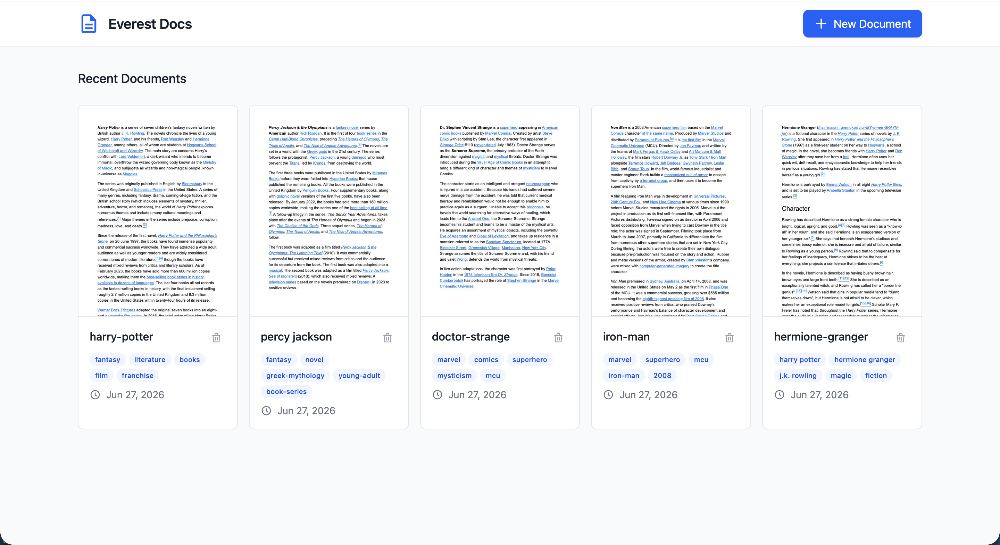

# Everest Docs

A Google Docs-like document management platform with rich text editing, AI-powered tagging, thumbnail previews, and cloud storage. Built with Go + React, designed as a gold-standard template for future microservices.



## Features

- **Rich text editor** — TipTap with pagination, headings, tables, fonts, and task lists
- **AI-powered tagging** — Auto-generates document tags via OpenRouter + Nemotron 3 Ultra (free, open-source)
- **Thumbnail generation** — Google Docs-style previews via headless Chrome (chromedp)
- **OpenAPI documentation** — Auto-generated from `.proto` files served at `/api/docs/openapi.json`
- **gRPC + REST** — Dual transport with shared service layer, proto-first API design
- **Health checks** — Readiness/liveness with DB + MinIO dependency status
- **Rate limiting** — 100 req/min per IP with Fiber limiter middleware
- **Security** — CSP, HSTS, CORS, input validation (bluemonday + struct tags), session cookies (gorilla/securecookie)
- **Version embedding** — Commit hash and build date baked into the binary via ldflags
- **Graceful shutdown** — Multi-server lifecycle (HTTP + gRPC) with signal handling

## Tech Stack

**Backend:**
- Go with Fiber web framework (HTTP) + gRPC
- PostgreSQL with `dbx` query builder (squirrel + sqlx)
- MinIO for S3-compatible object storage
- Chromedp for headless Chrome thumbnails
- Buf for protobuf code generation (Go stubs + OpenAPI v2)
- OpenRouter for AI model access (via Bifrost gateway)

**Frontend:**
- React 19 with TypeScript
- Vite build tooling
- Tailwind CSS v4
- TipTap rich text editor with pagination
- Redux Toolkit for state management

**Infrastructure:**
- Docker Compose (PostgreSQL, MinIO, Bifrost AI gateway)
- Air for hot-reload development
- Golang-migrate for schema migrations

## Quick Start

### Option 1: Full Docker Stack

```bash
make docker-up
```

This starts all services:
- **Frontend**: http://localhost:5173
- **Backend API**: http://localhost:8080
- **MinIO Console**: http://localhost:9001 (minioadmin/minioadmin)
- **Bifrost AI Gateway**: http://localhost:8081
- **PostgreSQL**: localhost:5432

After services are up, apply migrations and seed:

```bash
make migrate-up
make seed
```

To stop:

```bash
make docker-down
```

To stop and remove all data:

```bash
make docker-down -v
```

### Option 2: Local Development (Hot Reload)

#### Prerequisites

- Go 1.26+
- Node.js 22+
- PostgreSQL 16
- MinIO (or S3-compatible storage)
- Chrome/Chromium (for thumbnail generation)

#### Setup

1. **Install Go development tools:**
   ```bash
   make install-tools
   ```

2. **Copy environment file:**
   ```bash
   cp .env.example .env
   ```

3. **Start infrastructure services only:**
   ```bash
   make docker-infra
   ```

4. **Run database migrations:**
   ```bash
   make migrate-up
   ```

5. **Seed the database:**
   ```bash
   make seed
   ```

6. **Start the backend (with hot reload):**
   ```bash
   make dev
   ```

7. **In another terminal, start the frontend:**
   ```bash
   make web-install
   make web-dev
   ```

### AI Tagging Setup

To enable AI-powered document tagging:

```bash
# Start Bifrost AI gateway with OpenRouter
export OPENROUTER_API_KEY="sk-or-v1-..."
make docker-up  # includes bifrost service

# Set in .env:
AI_TAGGER_ENABLED=true
AI_TAGGER_MODEL=openrouter/nvidia/nemotron-3-ultra-550b-a55b:free

# Rebuild backend
make build && ./bin/everest
```

Tags are generated asynchronously after document create/update. Open [http://localhost:8080/health](http://localhost:8080/health) to verify services are running.

## Database Operations

### Migrations

```bash
make migrate-up      # Apply all pending migrations
make migrate-down    # Roll back all migrations
make migrate-version # Show current migration version
make migrate-create  # Create a new migration (prompts for name)
```

### Seeding

```bash
make seed        # Run all pending seeds
make seed-status # Show seed status
make seed-reset  # Reset seed tracking (re-run all seeds)
```

### Combined

```bash
make setup  # Run migrations + seeds
make fresh  # Drop all, migrate, seed (fresh start)
```

## Proto Generation

```bash
make proto       # Generate Go stubs + gRPC + OpenAPI spec
make proto-lint  # Lint proto files
```

Generated files committed at `api/gen/`. OpenAPI spec served at `/api/docs/openapi.json`.

## Makefile Commands

Run `make help` for the full list.

### Backend
| Command | Description |
|---------|-------------|
| `make build` | Build the server application |
| `make build-migrate` | Build the migrate CLI |
| `make run` | Build and run the application |
| `make dev` | Run with hot reload (requires air) |
| `make test` | Run tests |
| `make test-coverage` | Run tests with coverage report |
| `make lint` | Run linter |
| `make fmt` | Format code |
| `make tidy` | Tidy dependencies |
| `make proto` | Generate protobuf stubs + OpenAPI spec |

### Docker
| Command | Description |
|---------|-------------|
| `make docker-up` | Start all services (full stack with Bifrost) |
| `make docker-infra` | Start infrastructure only (PostgreSQL, MinIO) |
| `make docker-core` | Start core services (no Bifrost) |
| `make docker-down` | Stop Docker services |

### Database
| Command | Description |
|---------|-------------|
| `make migrate-up` | Apply all pending migrations |
| `make migrate-down` | Roll back all migrations |
| `make migrate-version` | Show current migration version |
| `make migrate-create` | Create a new migration file |
| `make seed` | Run all pending seeds |
| `make seed-status` | Show seed status |
| `make seed-reset` | Reset seed tracking |
| `make setup` | Run migrations + seeds |
| `make fresh` | Drop, migrate, and seed |

### Frontend
| Command | Description |
|---------|-------------|
| `make web-install` | Install frontend dependencies |
| `make web-dev` | Start frontend dev server |
| `make web-build` | Build frontend for production |

### Other
| Command | Description |
|---------|-------------|
| `make clean` | Clean build artifacts |
| `make install-tools` | Install development tools |

## Project Structure

```
everest/
├── .air.toml                 # Hot-reload configuration (air)
├── .opencode/agents/         # Dev guide + code review checklist
├── api/
│   ├── proto/documents/v1/   # Protobuf service definitions
│   ├── buf.yaml              # Buf module config
│   ├── buf.gen.yaml          # Code generation (Go + gRPC + OpenAPI)
│   └── gen/                  # Generated stubs + OpenAPI spec
├── cmd/
│   ├── server/main.go        # Entrypoint (10-line bootstrap)
│   └── migrate/main.go       # Migration CLI
├── db/
│   ├── migrations/           # SQL migration files
│   └── seeds/                # Database seed files
├── internal/
│   ├── app/                  # App struct (config + DB + Run)
│   ├── config/               # App-specific config with validation
│   ├── store/                # Data access interfaces (ports)
│   │   ├── document.go       #   DocumentStore
│   │   ├── content.go        #   ContentStore
│   │   ├── profile.go        #   UserProfileStore
│   │   └── errors.go         #   ErrNotFound, ErrConflict
│   ├── domain/model/         # Domain entities + value objects
│   ├── datastore/            # Data access implementations (adapters)
│   │   ├── postgres/         #   PostgreSQL-backed stores
│   │   └── minio/            #   MinIO-backed content store
│   ├── service/              # Business logic
│   │   ├── document.go       #   DocumentService
│   │   ├── tagger.go         #   AI-powered tagging
│   │   └── thumbnail.go      #   Thumbnail generation
│   ├── handler/
│   │   ├── http/             # REST handlers (domain-split files)
│   │   └── grpc/             # gRPC service implementation
│   ├── auth/                 # Authentication (Zitadel branch)
│   └── apperror/             # Typed application errors
├── pkg/                      # Reusable libraries (zero internal/ imports)
│   ├── bind/                 #   Request binding + validation
│   ├── configx/              #   Typed env config loader
│   ├── dbx/                  #   PostgreSQL query builder
│   ├── logger/               #   Structured logging
│   └── server/               #   HTTP + gRPC server lifecycle
├── web/                      # React frontend (Vite + TypeScript)
├── docker-compose.yml        # Services: postgres, minio, backend, frontend, bifrost
├── Dockerfile                # Backend Docker image (with Chromium)
├── bifrost-config.json       # Bifrost AI gateway provider config
├── Makefile                  # Build and dev commands
└── README.md
```

## Architecture

```
handler → service → store ← datastore
    ↓                   ↓
 apperror              domain/model
```

- **Handlers** call services, never the store directly
- **Services** call `store.Document()`, `store.Content()`, `store.Profile()` accessors
- **Store** defines interfaces. `datastore/` implements them (PostgreSQL, MinIO)
- **`pkg/`** packages have zero `internal/` imports — extractable to shared module
- **`domain/model/`** has zero dependencies on other internal packages

### Error Handling

Three-layer error system:

```
datastore → store.ErrNotFound → service → apperror.NotFound → handler → HTTP 404
```

- **Infrastructure**: Returns typed `store.ErrNotFound`, `store.ErrConflict` — never raw SQL errors
- **Service**: Translates via `errors.As()` to `apperror.*`
- **Handler**: Propagates to error handler middleware which auto-detects `*AppError`

### Store Pattern

```go
docStore := postgres.NewDocumentStore(db)
contentStore, _ := minio.NewContentStore(cfg)
st := store.New(docStore, contentStore, db.Close, db.Ping)
docService := service.NewDocumentService(st, thumbnailSvc, tagger, log)
```

Single `store.Store` composite injected into services. Sub-accessors: `st.Document()`, `st.Content()`.

## Environment Variables

See `.env.example` for all available configuration options:

| Variable | Description | Default |
|----------|-------------|---------|
| `APP_NAME` | Application name | `everest` |
| `PORT` | HTTP server port | `8080` |
| `LOG_LEVEL` | Log level (debug, info, warn, error) | `info` |
| `CORS_ORIGINS` | Allowed CORS origins | `http://localhost:5173` |
| `DATABASE_URL` | PostgreSQL connection string | - |
| `MINIO_ENDPOINT` | MinIO endpoint | `localhost:9000` |
| `MINIO_ACCESS_KEY` | MinIO access key | `minioadmin` |
| `MINIO_SECRET_KEY` | MinIO secret key | `minioadmin` |
| `MINIO_BUCKET` | MinIO bucket name | `documents` |
| `MINIO_USE_SSL` | Use SSL for MinIO | `false` |
| `GRPC_PORT` | gRPC server port (empty to disable) | `""` |
| `AI_TAGGER_ENABLED` | Enable AI tag generation | `false` |
| `AI_TAGGER_MODEL` | Model string for AI tagging | `openrouter/nvidia/nemotron-3-ultra-550b-a55b:free` |
| `AI_TAGGER_ENDPOINT` | AI gateway endpoint | `http://localhost:8081/v1/chat/completions` |
| `OPENROUTER_API_KEY` | OpenRouter API key (for Bifrost + AI tagging) | - |

## API Endpoints

| Method | Endpoint | Description |
|--------|----------|-------------|
| `GET` | `/health` | Health check with DB + MinIO status |
| `GET` | `/api/docs/openapi.json` | OpenAPI v2 specification |
| `GET` | `/api/v1/documents?page=1&size=20` | List documents (paginated, filtered by owner) |
| `POST` | `/api/v1/documents` | Create a document (JSON or multipart) |
| `GET` | `/api/v1/documents/:id` | Get a document |
| `PUT` | `/api/v1/documents/:id` | Update a document |
| `DELETE` | `/api/v1/documents/:id` | Delete a document |
| `GET` | `/api/v1/documents/:id/download` | Download document content |
| `GET` | `/api/v1/documents/:id/thumbnail` | Get document thumbnail |

### Health Check Response

```json
{
  "status": "ok",
  "version": "v0.1.0-3-gad3d214",
  "commit": "ad3d214",
  "checks": {
    "database": "ok",
    "storage": "ok"
  }
}
```

Returns HTTP 503 when any dependency is down.

### Error Response Format

All errors follow consistent structure:

```json
{
  "kind": "not_found",
  "message": "document abc not found"
}
```

Validation errors (422) include per-field details:

```json
{
  "kind": "validation",
  "message": "validation failed",
  "data": {
    "Title": {"tag": "max", "param": "500"}
  }
}
```

### Pagination

List endpoint supports `?page=` (default 1) and `?size=` (default 20, max 100). Response includes pagination metadata:

```json
{
  "documents": [...],
  "total": 42,
  "page": 1,
  "page_size": 20,
  "total_pages": 3
}
```

## Branches

| Branch | Purpose |
|---|---|
| `main` | Production code, no authentication |
| `zitadel_authentication` | Zitadel OIDC auth (BFF pattern, sever-side cookies) |

Sync policy: `main → zitadel_authentication` only. Never reverse.

## Development Guide

See `.opencode/agents/development.md` for full coding conventions, patterns, and the step-by-step feature development flow. See `.opencode/agents/review.md` for the PR review checklist (package dependencies, error handling, security, testing, database).

## License

MIT
